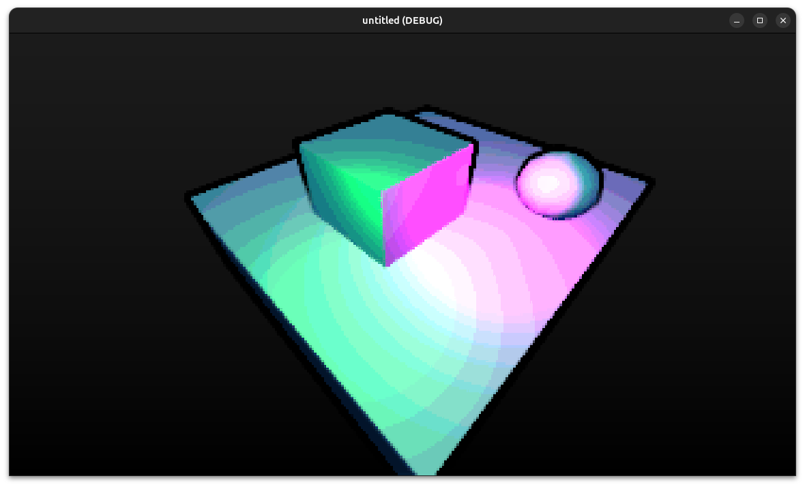
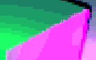

# Crunchy Shader
Made from scratch in less than half a day!

Features:
1. Pixellation
2. Posterization
3. Recoloring
4. Skybox
5. Outline

## Parameters
#### Misc
Virtual Height: The target height of virtual pixels to be rendered 
#### Skybox
Skybox Color Top: The color of the skybox at the top of the screen 
Skybox Color Btm: The color of the skybox at the bottom of the screen 
#### Outline
Outline Color: The color of the outline at the edge of objects 
Outline Strength: The darkness with which the outlines should be drawn 
Outline Width: The stroke width of outlines 
Outline Depth: The distance at which outlines fade 
Outline Falloff: The curve at which outlines fade 
#### Color
Color Step: The amount of color stages which should exist for each channel 
Color Falloff: The curve at which colors are changed with

## Breakdown
Steps: 
1. [Pixellation](#pixellation)
2. [Posterization](#posterization)
3. [Recoloring](#recoloring)
4. [Skybox](#skybox)
5. [Outline](#outline)

### Pixellation
The shader is pixellated by dividing, flooring, then multiplying the UV coordinates to create a new `VIRTUAL_UV` value. This is used in place of `SCREEN_UV` for the remainder of the processing. Note: This method of pixellation leaves intentional artifacts within the output, seen within figure 2. 

### Posterization
The shader posterizes by modifying the red, green, and blue channells individually according to the function `y = pow(round(x / a) * a, b)` where `a` is the shader parameter `COLOR_STEP` and `b` is the shader parameter `COLOR_FALLOFF`. 

### Recoloring
The shader turns dark blacks into dark blues by increasing the blue channel proportionally to the higher of the red and blue channels. 

### Skybox
The shader creates a skybox by first selecting skybox pixels by using `floor([depth])` to create a value that is by default 0 and is 1 only when the depth buffer has a value of 1. It then uses this value to select either the original color when it is zero (not skybox), and when the value is 1, it finds the value along the skybox gradient at `SCREEN_UV.y`. 

### Outline
The shader uses a sobel-like edge detection system to figure out whether to draw an outline. It samples the depth of the pixels adjacent and diagonal to the current pixel, then takes the difference of each and combines them to create a total value. The value defines how strong the outline at the current location should be.
